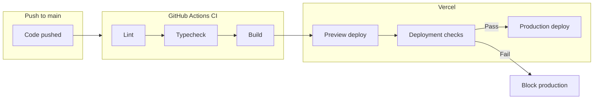

# Vercel Deployment Verification

This folder documents how to verify that **preview** and **production** deployments have passed or failed before they are promoted.

## Deployment Flow



## Preview vs Production

| Environment | Trigger | Status |
|-------------|---------|--------|
| **Preview** | Every push and PR | Built immediately; shows build logs in Vercel dashboard |
| **Production** | Merge to `main` | Blocked until Deployment Checks pass (CI) |

## Verifying Deployment Status

### 1. Vercel Dashboard

1. Go to [vercel.com/dashboard](https://vercel.com/dashboard)
2. Select the **stormlog-landing** project
3. Open **Deployments**
4. Check each deployment:
   - **Ready** — Build succeeded, deployment is live
   - **Building** — In progress
   - **Error** — Build or checks failed
   - **Canceled** — Deployment was canceled

### 2. Deployment Checks (Production)

Production deployments are promoted only after required checks pass:

1. **Settings** → **Git** → **Deployment Protection**
2. Enable **Deployment Checks**
3. Click **Add Checks** and add the required check: **`Lint, Typecheck & Build`** (must match the GitHub Actions job name exactly)
4. Vercel waits for the [CI workflow](../.github/workflows/ci.yml) to pass before promoting to production

**Important:** The check name in Vercel must exactly match the CI job name. Do not use `CI` — use `Lint, Typecheck & Build`.

### 3. CLI (when project is linked)

If the project is linked via `vercel link`:

```bash
# List recent deployments (preview and production)
./scripts/check-deployment-status.sh

# Or run directly
vercel ls
vercel inspect <deployment-url>
```

## Quick Reference

- **CI workflow**: [`.github/workflows/ci.yml`](../.github/workflows/ci.yml) — runs lint, typecheck, build. The job name **`Lint, Typecheck & Build`** must be added in Vercel Deployment Checks.
- **Vercel config**: [`vercel.json`](../vercel.json) — project settings (deployments enabled for all branches)
- **Deployment checks**: Configure in Vercel → Project Settings → Git → Deployment Protection

## Branch Behavior

| Branch | Deployment type |
|--------|-----------------|
| `main` | Production (aliased to production domain) |
| `dev`  | Preview |
| Other  | Preview |

## Making `main` deploy to production

If `main` does not appear in Vercel’s active branches or deployments:

1. **Connect the repository**
   - **Settings** → **Git** → ensure the GitHub repo is connected.
   - Reconnect if the integration was removed or is outdated.

2. **Set `main` as production branch**
   - **Settings** → **Git** → **Production Branch**
   - Set to `main` (or leave as default if your default branch is `main`).

3. **Enable deployments for `main`**
   - **Settings** → **Git** → **Ignored Build Step** / **Branch deployments**
   - Ensure `main` is not ignored.
   - Vercel deploys all branches by default; if you restricted branches earlier, add `main` back.

4. **Configure Deployment Checks**
   - **Settings** → **Git** → **Deployment Protection** → **Deployment Checks**
   - Enable Deployment Checks and add **`Lint, Typecheck & Build`**.
   - After merging to `main`, Vercel will create a production deployment and wait for that check to pass before promoting it.
