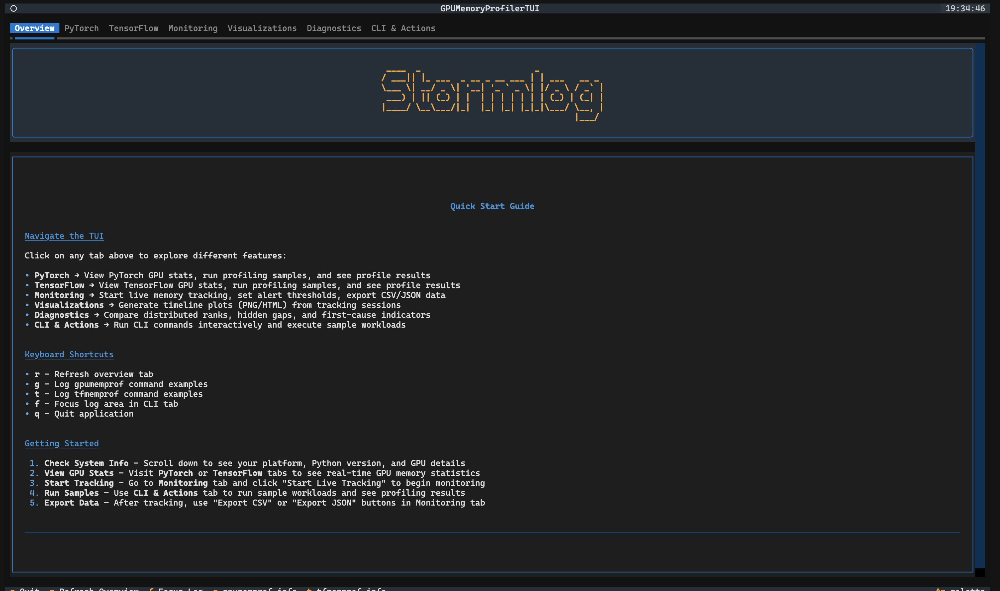

# Stormlog — Real-time GPU Memory Profiling

> Landing page for the Stormlog open-source GPU memory profiler

[](https://nextjs.org)
[](https://react.dev)
[](https://www.typescriptlang.org)
[](https://tailwindcss.com)

<p align="center">
  
</p>
<p align="center">
  <em>Stormlog TUI — Live GPU memory monitoring</em>
</p>

---

## Overview

This repository hosts the **landing page** for [Stormlog](https://github.com/Silas-Asamoah/stormlog), an open-source GPU memory profiler for PyTorch and TensorFlow teams.

Stormlog provides real-time GPU memory visibility, leak detection, diagnostics, and exportable timelines across CLI, Python API, and Textual TUI workflows. It helps ML engineers and research teams monitor allocation, catch OOM crashes before they waste compute, and ship evidence into debugging reviews and CI pipelines.

**Quick links**

- [Stormlog (main project)](https://github.com/Silas-Asamoah/stormlog)
- [Documentation](https://gpu-memory-profiler.readthedocs.io/en/latest/index.html)
- [PyPI package](https://pypi.org/project/gpu-memory-profiler/)

---

## What's on the landing page

The landing page is built as a single-page experience with these sections:

- **Hero** — Headline, install CTA, and overview video
- **Ecosystem** — Frameworks (PyTorch, TensorFlow), workflows (CLI, Python API, TUI), and exports (JSON, CSV, HTML)
- **Problem** — Why GPU memory visibility matters
- **Features** — Live visibility, actionable diagnostics, flexible workflows
- **Workflow** — Instrument → Observe → Diagnose → Export → Optimize
- **TUI showcase** — Interactive gallery of Stormlog TUI screenshots
- **Before/After** — Workflow comparison
- **Maintainers** — Core team with GitHub links
- **CTAs** — Docs, GitHub, PyPI

---

## Tech stack

| Category   | Technologies                                                                 |
| ---------- | ---------------------------------------------------------------------------- |
| Framework  | Next.js 16, React 19                                                         |
| Styling    | Tailwind CSS 4, class-variance-authority, clsx, tailwind-merge                |
| UI         | shadcn/ui, Radix UI, lucide-react                                            |
| Motion     | GSAP (ScrollTrigger), Framer Motion                                          |
| Themes     | next-themes                                                                   |
| Language   | TypeScript 5                                                                 |

---

## Project structure

```
stormlog-landing/
├── src/
│   ├── app/           # Next.js App Router (page.tsx, layout.tsx)
│   ├── components/    # Sections, layout, UI primitives
│   ├── data/          # content.ts, navigation.ts
│   ├── hooks/
│   └── lib/
├── public/
│   └── images/        # TUI screenshots, overview video
└── package.json
```

---

## Getting started

**Prerequisites:** Node.js 18 or later

1. Clone the repository:

   ```bash
   git clone https://github.com/Silas-Asamoah/stormlog-landing.git
   cd stormlog-landing
   ```

2. Install dependencies:

   ```bash
   npm install
   ```

3. Start the development server:

   ```bash
   npm run dev
   ```

4. Open [http://localhost:3000](http://localhost:3000) in your browser.

**Scripts**

| Command         | Description              |
| --------------- | ------------------------ |
| `npm run dev`   | Start development server |
| `npm run build` | Build for production     |
| `npm run start` | Start production server  |
| `npm run lint`  | Run ESLint               |
| `npm run typecheck` | Run TypeScript check |

---

## Deployment

This repo is set up so GitHub Actions is the deployment gatekeeper:

- [`.github/workflows/ci.yml`](.github/workflows/ci.yml) runs `lint`, `typecheck`, and `build` on every push and pull request.
- [`.github/workflows/deploy-production.yml`](.github/workflows/deploy-production.yml) deploys to Vercel only after the `CI` workflow succeeds for a push to `main`.
- [`vercel.json`](vercel.json) disables automatic Git-based Vercel deployments, so feature branches do not deploy on their own.

### One-time Vercel setup

1. Create or import the project in [Vercel](https://vercel.com/new).
2. Add these GitHub repository secrets:
   - `VERCEL_TOKEN`
   - `VERCEL_ORG_ID`
   - `VERCEL_PROJECT_ID`
3. Keep `main` as your production branch in Vercel.

After that:

- Branches other than `main` will still get CI checks, but they will not deploy.
- A push to `main` will deploy only if CI has already passed.

---

## Links

- [Stormlog (main project)](https://github.com/Silas-Asamoah/stormlog)
- [Documentation](https://gpu-memory-profiler.readthedocs.io/en/latest/index.html)
- [PyPI package](https://pypi.org/project/gpu-memory-profiler/)
- [Issues](https://github.com/Silas-Asamoah/stormlog/issues)
- [Contributing](https://github.com/Silas-Asamoah/stormlog/blob/main/CONTRIBUTING.md)

---

## Maintainers

- **Prince Agyei Tuffour** — [@nanaagyei](https://github.com/nanaagyei)
- **Silas Asamoah** — [@Silas-Asamoah](https://github.com/Silas-Asamoah)
- **Derrick Dwamena** — [@dwamenad](https://github.com/dwamenad)
